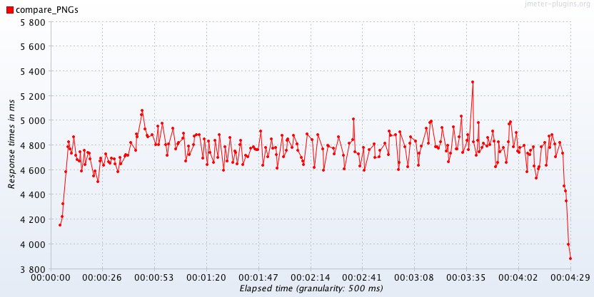
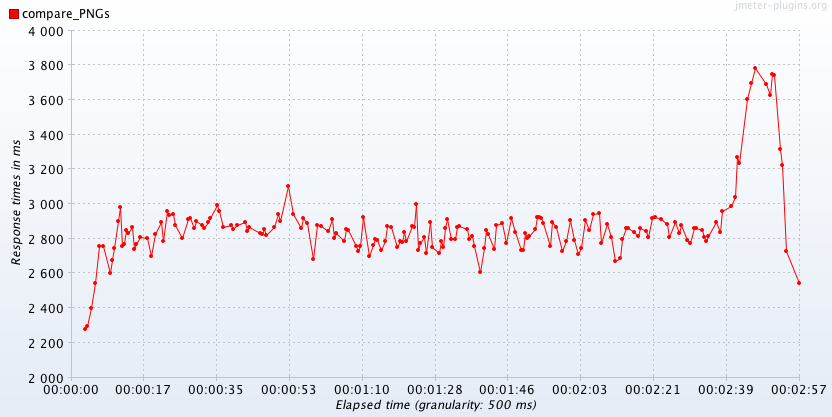
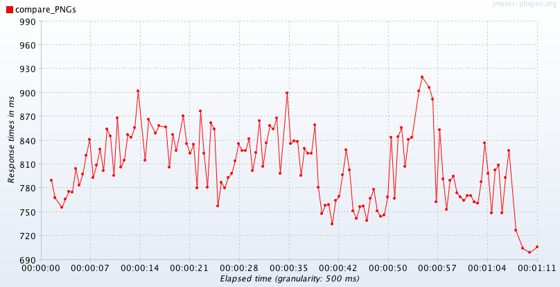

# Leeloo - Leela's younger cousin

> from the 5th Element of Elixir ;)

**Leela's cousin**, fooling around with PNGs and basic Imagemagick, using Elixir .. of course

## Scope

 - find the differences between two (.PNG) images and obtain a third image containing the visual differences.
 - create a simple Elixir web microservice, for prototyping and testing purposes.
 - tinkering at cool stuff

For testing, we'll use these two images:

|image 1|  |image 2|
|--------|---|-----|
| | vs. | |

The prototype must successfully return the following:

- if the images match: `{"ok": "match"}`
- if the images are different (excerpt):
   `{"error": "no_match", "diff_metric": 526, "diff_visual": "data:image/png;base64,iVBORw0KGgII...=="}`
- if the images have different heights or widths: `{:error, :widths_or_heights_differ}`

The differences between the two test images should look like this, after processing:


This is a raw result, yet accurate! However, with ImageMagick, we can improve the resulting diff image even further, if need be.

## To test/dev/run the prototype

You'll need:

- elixir (~> 1.4)
- ImageMagick (~> 6.9.xx)
- curl (wget ...)


## Installation and test

pull the repo and then:

```shell
$ cd leeloo
$ mix do deps.get, compile
$ MIX_ENV=test mix espec --cover
```

If your environment is properly configured for Elixir development, then you should see approximately this, (excerpt)

```
.........

	9 examples, 0 failures
	Finished in 1.41 seconds (0.43s on load, 0.97s on specs)
	Randomized with seed 577470

----------------
COV    FILE                                        LINES RELEVANT   MISSED
  0.0% lib/leeloo.ex                                  18        3        3
 77.8% lib/leeloo/api.ex                              60        9        2
 86.7% lib/leeloo/image_diff.ex                       48       15        2
[TOTAL]  74.1%
----------------
```

## Start the web server

```elixir
$ mix run --no-halt

23:43:16.398 [info]  Starting Elixir.Leeloo.Api with Cowboy on http://127.0.0.1:4000
```

`Leelo` is up and receiving requests at `http://127.0.0.1:4000`

Quick test:

```shell
$ curl http://127.0.0.1:4000/api/echo -X POST
```
The server will respond with: `{"echo":"Sup?!"}`

## Play with (:base64 encoded) images

Given you Base64 encoded the desired images and having the server running at `http://127.0.0.1:4000`, run the following simple test:

```shell
curl -H "Content-Type:application/json" -X POST http://127.0.0.1:4000/api/compare/png_strings \
  -d '{"images": {"reference" : "data:image/png;base64,iVBORw0KG...gg==", "comparison": "data:image/png;base64,iVBORw0KGgoRK5....CYII="}}'

```
(the example above is using the two **different** fixture images shown earlier, for testing)

Mind you, the `curl` above is truncated, for brevity purpose. Please see the [curl.txt](curl.txt) file, in the project's main folder, for the full command line.

With the specified curl from the example file, you'll get back information about the differences between the two given images. Leelo will return a json like this (excerpt):

```json
{"error":"no_match","diff_visual":"data:image/....==", "diff_metric":526}
```

and on the server console, you can see the logs:

```
12:02:55.049 [info]  POST /api/compare/png_strings
12:02:55.063 [info]  Sent 201 in 14ms
```

Ok, `14ms` it's a lot for an Elixir app, but don't forget that we run an external command under the hood; imagemagick

## **Upload** and Compare

To reduce the payload and streamline the API dialog, you can also upload the image files, rather than encoding them and shipping them as large strings. 

Here's a `curl` command to get you started:

```shell
curl -X POST http://localhost:4000/api/compare/pngs \
  -F "images[reference]=@/path/to/file1.png" \
  -F "images[comparison]=@/path/to/file2.png"
```

When uploading images and Leeloo finds differences the server will respond with something like this:

```json
{
 "error": "no_match",
 "diff_visual":"static/bTdRMzlXSWo5QmpZcHZJdHpNQ2JEUT09.png", 
 "diff_metric":3120
}
```

Observe the `diff_visual` attribute! Leeloo saves the image resulting from cmparing the two images, the reference image and the comparison one, and replies back with a link from where you can download it. Basically, point your browser to `http://localhost:4000/static/bTdRMzlXSWo5QmpZcHZJdHpNQ2JEUT09.png` and you can download the image file containing the visual differences between the two images.

### One more thing

When using the upload images api, you can also specify a new attribute: `fuzz`. Like this:

```shell
curl -X POST http://localhost:4000/api/compare/pngs \
  -F "images[fuzz]=10%" -F "images[reference]=@/path/to/file1.png" \
  -F "images[comparison]=@/path/to/file2.png"
```

Use this option to match colors that are close to the target color in RGB space and eventually ignore the colors that differ by a small amount. This option can account for these differences.

The `fuzz` distance can be a percentage of the maximum possible intensity; i.e. `20%`
If you set `fuzz` to 100%, then you'll get a `match` between two **different** images. Use it with care :)

### Some stats

We load tested Leeloo, with 6 users, on a MacBook Pro with the following characteristics:

```
Processor Name: Intel Core i7
Processor Speed:  2.2 GHz
Number of Processors: 1
Total Number of Cores:  4
Memory: 16 GB
```

And obtained the following stats:

#### Large images (~6MB)



summary:

| Label             | # Samples | Average | Min  | Max  | Std. Dev. | Error % | Throughput | KB/sec | Avg. Bytes | 
|-------------------|-----------|---------|------|------|-----------|---------|------------|--------|------------| 
| main:compare_PNGs | 300       | 4774    | 3882 | 5313 | 143.00    | 0.00%   | 1.1        | 0.32   | 295.0      | 
| TOTAL             | 300       | 4774    | 3882 | 5313 | 143.00    | 0.00%   | 1.1        | 0.32   | 295.0      | 


#### Medium images (~3MB)



summary:

| Label             | # Samples | Average | Min  | Max  | Std. Dev. | Error % | Throughput | KB/sec | Avg. Bytes | 
|-------------------|-----------|---------|------|------|-----------|---------|------------|--------|------------| 
| main:compare_PNGs | 300       | 2885    | 2277 | 3877 | 201.69    | 0.00%   | 1.7        | 0.49   | 295.0      | 
| TOTAL             | 300       | 2885    | 2277 | 3877 | 201.69    | 0.00%   | 1.7        | 0.49   | 295.0      | 


#### "Small" images (~1MB)


summary:

| Label             | # Samples | Average | Min | Max | Std. Dev. | Error % | Throughput | KB/sec | Avg. Bytes | 
|-------------------|-----------|---------|-----|-----|-----------|---------|------------|--------|------------| 
| main:compare_PNGs | 300       | 818     | 699 | 960 | 47.80     | 0.00%   | 4.2        | 1.23   | 297.0      | 
| TOTAL             | 300       | 818     | 699 | 960 | 47.80     | 0.00%   | 4.2        | 1.23   | 297.0      | 


`Leeloo` is currently under development, but ready for some real life challanges :)

Enjoy!
